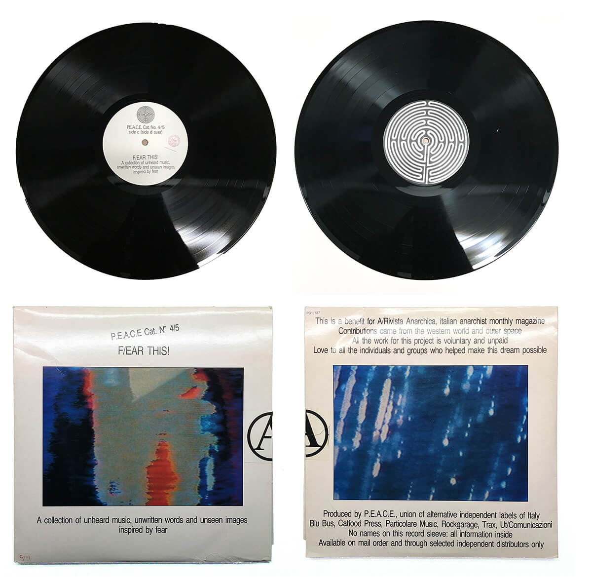

# F/EAR THIS! unheard music, unwritten words and unseen images inspired by fear

### Table of Contents
1. [Artefact](#Artefact)
    1. [Metadata](#Metadata)
2. [Research](#Research-h1)
3. [Transcoding](#Transcoding)
    1. [Transcoding No. 1](#Transcoding-no-1)
    2. [Transcoding Tool](#Transcoding-tool)
4. [Reflection](#Reflection)
5. [Outcome](#Outcome)
6. [Conclusion](#Conclusion)
7. [Bibliography](#Bibliography) 

# Artefact
F/EAR THIS! is a double album published by PEACE in 1987, the association of independent Italian alternative labels in support of "A / Anarchist Magazine ". The project was built by friends, musicians, graphic designers and poets scattered everywhere, both in Italy and abroad. All of them were putting together music, words and images built around a common idea, fear.

## Metadata
| Tag | Data |  
|--|--|
**IISG Call Number** | [ IISG BG PG1/137](https://hdl.handle.net/10622/04283EB5-0743-49D1-B1F5-468375E14BCA )
| **Physical Description** | 33 rpm + 2 vol. text-book. 
| **Language** | Italian, English
| **Published* | (Ca. 1987) s.l. :PEACE)
| **Note** | A benefit for A/Revista Anarchica.
| **Other organisation(s)** | 	PEACE 
|[]| This is literally a description of what you see in the image, make sure its a clear, complete and concise overview of the artefact. It should make sense for someone who doesn't see the image itself.  Our final *Catalogue of Resilience* might make use of one representative image from each student, so important to put your moneyshot here. You can build a gallery of additional artefact images below. 

### Music & Ideas, curated by Marco Pandin 
"F / Ear this!" is a double album published by PEACE, the association of independent Italian alternative labels (which includes Blu Bus, Catfood Press, Particolare Music, Rockgarage, Trax, Ut / Comunicazioni and, recently, also Tunnel) in support of "A / Anarchist Magazine ".

The project was born at the beginning of last year: putting together music, words and images built around a common idea, asking for help from friends, musicians, graphic designers and poets scattered everywhere, both in Italy and abroad. All in all a simple and transparent initiative: once the theme was chosen (in this case, "fear"), a word-of-mouth mechanism was set in motion which, despite some complications and the inevitable accidents and delays, worked very well, arriving from here around Europe to the United States. Made some phone calls, sent a few letters and so put the rumor around, the material for "F / Ear this!" it came almost by itself: no contracts, no fees for participation, nor promises difficult to keep. Everyone collaborated freely and spontaneously, an absolutely indispensable condition for being able to "work" cleanly and satisfactorily.

In terms of musical "genres", this collection is obviously quite composite: it ranges from large and evocative atmospheres (the compositions of Giorgio Cantoni and the 2 + 2 = 5, for example) to the minimal chiseling work (the French Look De Bouk and the New Yorkers Hum), from hot and intelligent rock (Franti and the German Body & the Buildings among others) to the more cerebral experimentalism (such as that of Nurse With Wound and ParoksiEksta) to chemical laboratory jazz (Doctor Nerve, Don King and our Detonation).
We remain however, and this applies to all participants, in an "attitude sector" that sees creativity as a vital and positive fact, an instrument that, through words, sounds and images, tells people, their ideas, dreams and desires .

### Tracklist
| Side | Band | Track | Time | Link
|--|--|--|--|--|
|A1| Two Tone|	Sometimes Timid / My Womb 	|4:01| https://www.youtube.com/watch?v=8jr2YvlHqRI&feature=emb_logo|
|A2| Detonazione|	Dead Planet Blues 	|4:57| https://www.youtube.com/watch?v=Ckkh4ED0pUU&feature=emb_logo|
|A3|The Blech| 	Wehr Kardoon (Recorded Live) 	|2:55|https://www.youtube.com/watch?v=aXaIe_s4M0E|
|A4|Look De Bouk| 	Un Ecrin De Fer-Blanc Pour Le Noir Des Tes Cils (Extracts) 	|6:04|https://www.youtube.com/watch?v=hrR3C6Pn-bI |
|A5|Politrio |	Bolero IV 	|4:14|https://www.youtube.com/watch?v=2VRfGfCj9SU|
|A6| Embryo (3)| 	Aperto 	|6:43|?|
|B1| History Of Unheard Music| 	Lawn Rangers 	|4:33|https://www.youtube.com/watch?v=fMhgViu606w|
|B2|Franti |	Voghera (Recorded Live) 	|3:42|?|
|B3|LA1919* |	Senza Tregua No. 2 (1986 Remix) 	|3:17|https://www.youtube.com/watch?v=gehqi7KZOHU&list=UU9KPDqc4Gsv-YD5IL4r1CBQ&index=6|
|B4|Body & The Buildings |	Assume To Be Dreaming 	|5:18|https://www.youtube.com/watch?time_continue=5&v=OrJamOtEYUk&feature=emb_logo|
|B5|Giorgio Cantoni |	Un Anno Nelle Favelas 	|3:48|https://www.youtube.com/watch?v=iKova8JoEkI&feature=emb_logo|
|B6|Jane Dolman And Pete Wright |	Fishes In Water 	|5:56|https://www.youtube.com/watch?v=-HJ79fZb_pE&feature=emb_logo|
|B7|2+2=5|	Guang Zhou 	|3:28|https://www.youtube.com/watch?v=rsKFAnZVwLc&feature=emb_logo|
|C1|Orient-Express |	In Articulo Mortis 	|3:19|https://www.youtube.com/watch?v=wjX7AH_YCjs&feature=emb_logo|
|C2|Weimar Gesang |	Light-Tight Place (Hammer Version) 	|4:44|https://www.youtube.com/watch?v=-12aHhBSAdA|
|C3|Annie Anxiety* |	It Was July... 	|2:33|https://www.youtube.com/watch?v=QT0X30y29yo&feature=emb_logo|
|C4|Gregorio R.U.S. Bardini* |	Invocazione Di Giuliano Kremmerz 	|3:00|?|
|C5|Don King |	Fern Gully (Recorded Live) 	|3:48|?|
|C6|Doctor Nerve |	Unna (Recorded Live) 	|3:02|?|
|C7|Nick Didkovsky And Limpe Fuchs| 	When Hands Fall 	|8:22|?|
|D1|Nurse With Wound |	Ship Of The Dead 	|7:27|https://www.youtube.com/watch?v=aTqTHWEufTo&feature=emb_logo|
|D2|Die Form |	Fear Of My Hands 	|3:15|https://www.youtube.com/watch?v=Wk-WTSubM04&feature=emb_logo|
|D3|Possession |	De Vermis 	|4:44|?|
|D4|Thelema |	J. C. S. / A Pagan Ritual 	|9:02|https://www.youtube.com/watch?v=zb2Z-pMe4ug|
|D5|Paroksi-Eksta| 	Pneuma Ha Ïato |5:05|?|

### Booklet

[]

[[1]](#footnote-1)
# Research 
## Reasearch Questions 
You can't see fear, can't hold it in your hands. It's experience based, what are the tools that can be used to recreate this context digitally?

Is fear something universal, or does it change depending on the localisation, the epoch? Is there a need to archive different form of fear, from different epochs, from different countries?

If it is necessary to keep an updated archive of fear samples, what would be this samples of contemporary fear be looking like?

# Transcoding
With the technological resilience, how to preserve audio in the best quality and easiest accessibilty? The original rpm record is one of the most stable audio formats, capable of lasting around 100 years in a controlled environnement. But one copy, stuck in the archive, isn't accessible to a lot of people. The project should reach everyone, as everyone already experienced fear at least once in their life. How to preserve the meaning of the audio, but making it accessible to a broader audience? A website was the ideal thing. The website is generating sound by the users movement, creating a new digital fear inspired experience. On the other hand, samples from the original tracklist is made accessible by using the keyboard.

## Transcoding No. 1
### Cover and Logo redesign
On the IISG website, no image of the record is available. The first technical transcoding was doing reproduction of the original record, but since it's no longer accessible. A digital remake had to be done. Now it's also printable, if one time someone would like to have a physical copy. The logo also had to be vectorized, so future transcoding don't destroy the old images.

## Transcoding Tool 
### Description
Creating sound digitally, playing with the interactive possibilities of the computer to generate, randomly, or artificially sounds that refer to the language of fear, or personnal emotions. The whole website is the transcoding tool, using a platform as an environnement instead of a transparent piedestral showing objects or a finished work. It is also questionning the process of works, having a musical experience that is for everyone unique.

### Aims
The aim of the tool is to create a new digital experience for the user, based on his own movements.  

### Methods
p5.js was mainly used for creating the sound. Quicktime player and basic sound tools were also used. For the visual language, C4D was mainly used.

# Reflection
Fear is now omnipresent in our way of living. We are always hiding it, trying to escape from it. With this project, it's also about experiencing this feeling in a new way, talking about digital sensations that are more and more present.

# Outcomes
An interactive sound website

### Outcome Links
www.fearthis.com (still not online)
 

# Conclusion 

## Bibliography

<a name="footnote-1">**[1]**</a>: Look at this little referenced footnote over here. You can look up different text formats for referencing books, online articles, films etc. 
