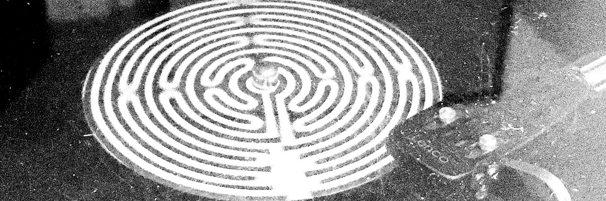

# F-EAR-THIS-
 # F/EAR THIS! unheard music, unwritten words and unseen images inspired by fear

https://www.notion.so/F-EAR-THIS-unheard-music-unwritten-words-and-unseen-images-inspired-by-fear-ad713be0d94f44c9b0a16d3284704c03#73586152ac0047f482a480f10ff62293

https://www.notion.so/F-EAR-THIS-unheard-music-unwritten-words-and-unseen-images-inspired-by-fear-ad713be0d94f44c9b0a16d3284704c03

### anarchist magazine
year 17 nr. 146
May 1987

### This is a benefit for A/Rivista Anarchica, italian anarchist monthly magazine.
Contributions came from the western world and outer space.
All the work for this project is voluntary and unpaid.
Love to all the individuals and groups who helped make this dream possible.
Two-record set

Conceived and compiled by Marco Pandin
Title from an idea by vittore Baroni
Cover photographs taken from a computer video by Marco Broll

Produced by P.E.A.C.E., union of alternative independant labels of Italy, Blu Bus, Catford Preff, Particolare Music, Rockgarage, Trax, Ut/Communicazioni

Blu Bus c/o Stefano Giaccone 66, c.so Siracusa 10136 Torino (Italy)
Catfood Press c/o Marco Pandin 1, via del Gaggian 30170 Mestre Venezia (Italy)
Particolare Music c/o Sergio Volpato 8, via Oldelle 36050 Pianezze Vicenza (Italy)
Rockgarage Box 3268 30170 Mestre Centro Venezia (Italy)
Trax c/o Vittore Baroni 2, via Raffaelli 55042 Forte dei Marmi Lucca (Italy)
Ut/Communicazioni c/o Giacomo Spazio 51, via De Amicis 20123 Milano (Italy)
For information and backcatalogues please write to the above adresses

F/Ear this! is a benefit entreprise: all the work is voluntary and unpaid
All proceeds from this album go to A/Rivista Anarchica please write to Editrice A Box 17120 20170 Milano (Italy)

Thanks to all the people who helped make this dream possible
Also thanks to Plasticost, Rivolta dell'Odio, The Capers, Funkwagen, Massimo Giacon, Mimi Colucci and Fox for their work not included in the album.

# Music & ideas (en)
curated by Marco Pandin ([marcpan@tin.it](mailto:marcpan@tin.it))
"F / Ear this!" is a double album published by PEACE, the association of independent Italian alternative labels (which includes Blu Bus, Catfood Press, Particolare Music, Rockgarage, Trax, Ut / Comunicazioni and, recently, also Tunnel) in support of "A / Anarchist Magazine ".

The project was born at the beginning of last year: putting together music, words and images built around a common idea, asking for help from friends, musicians, graphic designers and poets scattered everywhere, both in Italy and abroad. All in all a simple and transparent initiative: once the theme was chosen (in this case, "fear"), a word-of-mouth mechanism was set in motion which, despite some complications and the inevitable accidents and delays, worked very well, arriving from here around Europe to the United States. Made some phone calls, sent a few letters and so put the rumor around, the material for "F / Ear this!" it came almost by itself: no contracts, no fees for participation, nor promises difficult to keep. Everyone collaborated freely and spontaneously, an absolutely indispensable condition for being able to "work" cleanly and satisfactorily.

In terms of musical "genres", this collection is obviously quite composite: it ranges from large and evocative atmospheres (the compositions of Giorgio Cantoni and the 2 + 2 = 5, for example) to the minimal chiseling work (the French Look De Bouk and the New Yorkers Hum), from hot and intelligent rock (Franti and the German Body & the Buildings among others) to the more cerebral experimentalism (such as that of Nurse With Wound and ParoksiEksta) to chemical laboratory jazz (Doctor Nerve, Don King and our Detonation).
We remain however, and this applies to all participants, in an "attitude sector" that sees creativity as a vital and positive fact, an instrument that, through words, sounds and images, tells people, their ideas, dreams and desires .

# F/EAR THIS! unheard music, unwritten words and unseen images inspired by fear

### Table of Contents
1. [Artefact](#Artefact)
    1. [Metadata](#Metadata)
2. [Research](#Research-h1)
3. [Transcoding](#Transcoding)
    1. [Transcoding No. 1](#Transcoding-no-1)
    2. [Transcoding Tool](#Transcoding-tool)
4. [Reflection](#Reflection)
5. [Outcome](#Outcome)
6. [Conclusion](#Conclusion)
7. [Bibliography](#Bibliography) 

# Artefact
You should include a short introduction about your artefact here. Keep in mind: there is space in the metadata (below) to include the 'formal' or 'physical' description. In your [Research](#Research-h1) section (even lower below) you can expand on the context, history and relevant information for the audience. This little introduction here should have a short, overview quality. Just enough to give a clear overview, before getting into details.  

## Metadata
| Tag | Data |  
|--|--|
**IISG Call Number** | [ IISG BG PG1/137](https://hdl.handle.net/10622/04283EB5-0743-49D1-B1F5-468375E14BCA )
| **Physical Description** | 33 rpm + 2 vol. text-book. 
| **Language** | Italian, English
| **Published* | (Ca. 1987) s.l. :PEACE)
| **Note** | A benefit for A/Revista Anarchica.
| **Other organisation(s)** | 	PEACE 
|| This is literally a description of what you see in the image, make sure its a clear, complete and concise overview of the artefact. It should make sense for someone who doesn't see the image itself.  Our final *Catalogue of Resilience* might make use of one representative image from each student, so important to put your moneyshot here. You can build a gallery of additional artefact images below. 

# Research (H1)

This section consolidates the background research, context and any relevant information regarding your research **into** the artefact.

## Research Sub-Heading (H2)
Its important to give a clear structure to your Readme. Please use the document structure provided by markdown, so think of Headings, Sub-headings, text, bold/italic, lists (bullets and numbered), tables etc. You can also include some linked footnotes like this. [[1]](#footnote-1)

### Research Sub-sub-heading (H3)
The H3 heading is useful to define specific subsections within the H2 section. If you are in doubt about information structure, take a look at different wikipedia articles for reference. 

# Transcoding
Please include a general description of the role of transcoding in your project. Using the H2 headings below, you can specify individual Transcoding experiments. Think about your motivations in transcoding, and mention the role of tools (also those made during the assignment). This gives some direction to the reader about what they will read in more detail below. 

## Transcoding No. 1
### Description
Short description here. You can structure the information and documentation for each transcoding, design research or coding tool as you like. It's important that you make clear the aims & goals of the transcoding, what methods and tools you use. If this is often the same across different transcodings, consider making a standardised table at the beginning of each.

You should include well-formatted documentation of your experiments and developments below. Someone without previous knowledge about your work should be able to follow along the steps, aims and results of your developments from this structure. Make sure all media used is correctly linked or embedded (images, PDFs, Videos, etc). 

### Methods
Description of your methods, documentation of behind-the-scenes processes can go here. Think of the photos and videos you made when visiting the IISG or during captures of your artefact. You can use tools such as [Gifs.com](https://gifs.com/) to generate moving-image thumbnail to link to short videos.Just enough to give a clear overview, before getting into details.  

With some HTML tags you can do simple styling in markdown, for example:

    <width="50%">

Remember to include the url link to jump to the full media, of course! 

### Tools 
Mention the tools that you used or made (if and when relevant). 

### Results
Some of your transcoding experiments may have smaller outcome sketches like images or short video tests. They can go directly within this section. Or maybe this transcoding became a part of the final outcome format. When that is the case, you can simply include a [hyperlink](#) to the final outcomes in the **Transcoding** section. In the final outcome section below you can embed or explain the final format outcome in detail.  

## Transcoding Tool 
### Description
You might have made multiple coding tools during the semester. Or the transcoding tool might be part of a specific transcoding experiment itself. It's up to you to define the linear flow of the Readme. Just like the transcoding of media itself, the coding tool should be well documented. So if you are using a coding tool in your first experiment, include the documentation of the coding tool **before** you include the results, etc. 

### Aims
Include the main aims or intentions behind making the tool, and what it is used for. 

### Methods
This includes the coding languages, coding frameworks or libraries, and any platforms or webtools for example.   

### Results
The coding tool will vary a lot between different students. So depending on the use and type, you may include more or less documentation here. 

### Source Links
Please include links to the tools, sources etc used during the coding. E.g. the resources used for making your coding tool.  
 

# Reflection
You might want to include a section about reflecting on the results of your coding and IMD experiments this semester. It can give additional context before reading the final outcomes below. 

# Outcomes
This section will be different for each student, depending on how and what is formatted as a final result for the semester assignment. Nevertheless a clear written and documented outcomes is important. So give the appropriate subsections or formats to make this as thorough as possible. 

### Outcome Links
Here you link to your final assignment outcomes. This could be a website, a video, etc etc. Please include links to the appropriate GitHub folder on your repository where your coding tool is stored. 

This is the main way to access your IMD + Coding outcomes for the semester. So its very important that you check for bugs, troubleshoot hyperlink issues, embedded media issues etc. Please make sure you KNOW where each file you use is stored. E.g. If you migrated from Notion markdown into GitHub, its **VERY IMPORTANT** to know that Notion randomly stores images on an Amazon server. It changes those locations all the time. So if your main outcome or documentation is still grabbing those links, **its very likely** they might disappear before collectives. So please have all media and necessary files managed well in your own locations (online or github etc).   

# Conclusion 
You might have a nice conclusive observation to share at the end :) 

## Bibliography
Of course, as with all research work please include a good bibliography with links, and any references that were used or might give additional depth to the work. 

<a name="footnote-1">**[1]**</a>: Look at this little referenced footnote over here. You can look up different text formats for referencing books, online articles, films etc. 
