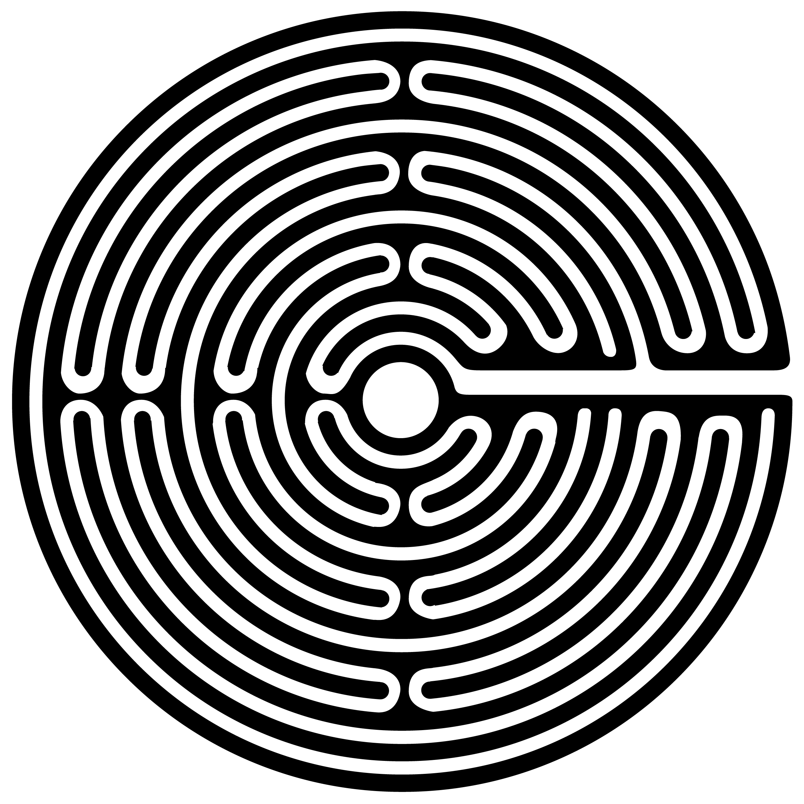

# F/EAR THIS! unheard music, unwritten words and unseen images inspired by fear

### Table of Contents
1. [Artefact](#Artefact)
    1. [Metadata](#Metadata)
2. [Research](#Research-h1)
3. [Transcoding](#Transcoding)
    1. [Transcoding No. 1](#Transcoding-no-1)
    2. [Transcoding Tool](#Transcoding-tool)
4. [Reflection](#Reflection)
5. [Outcome](#Outcome)
6. [Conclusion](#Conclusion)
7. [Bibliography](#Bibliography) 

# Artefact
F/EAR THIS! is a double album published by PEACE in 1987, the association of independent Italian alternative labels in support of "A / Anarchist Magazine ". The project was built by friends, musicians, graphic designers and poets scattered everywhere, both in Italy and abroad. All of them were putting together music, words and images built around a common idea, fear.

## Metadata
| Tag | Data |  
|--|--|
**IISG Call Number** | [ IISG BG PG1/137](https://hdl.handle.net/10622/04283EB5-0743-49D1-B1F5-468375E14BCA )
| **Physical Description** | 33 rpm + 2 vol. text-book. 
| **Language** | Italian, English
| **Published* | (Ca. 1987) s.l. :PEACE)
| **Note** | A benefit for A/Revista Anarchica.
| **Other organisation(s)** | 	PEACE 
|| This is literally a description of what you see in the image, make sure its a clear, complete and concise overview of the artefact. It should make sense for someone who doesn't see the image itself.  Our final *Catalogue of Resilience* might make use of one representative image from each student, so important to put your moneyshot here. You can build a gallery of additional artefact images below. 

# Research (H1)
## Reasearch Questions (H2)
You can't see fear, can't hold it in your hands. It's experience based, what are the tools that can be used to recreate this context digitally?

Is fear something universal, or does it change depending on the localisation, the epoch? Is there a need to archive different form of fear, from different epochs, from different countries?

If it is necessary to keep an updated archive of fear samples, what would be this samples of contemporary fear be looking like?

## Physical record (H2)
 

[<video src="Documentation/img/booklet.mp4" width="100%">](#) 

[[1]](#footnote-1)

### Research Sub-sub-heading (H3)
The H3 heading is useful to define specific subsections within the H2 section. If you are in doubt about information structure, take a look at different wikipedia articles for reference. 

# Transcoding
With the technological resilience, how to preserve audio in the best quality and easiest accessibilty? The original rpm record is one of the most stable audio formats, capable of lasting around 100 years in a controlled environnement. But one copy, stuck in the archive, isn't accessible to a lot of people. The project should reach everyone, as everyone already experienced fear at least once in their life. How to preserve the meaning of the audio, but making it accessible to a broader audience? A website was the ideal thing. The website is generating sound by the users movement, creating a new digital fear inspired experience. On the other hand, samples from the original tracklist is made accessible by using the keyboard.

## Transcoding No. 1
### Cover and Logo redesign
On the IISG website, no image of the record is available. The first technical transcoding was doing reproduction of the original record, but since it's no longer accessible. A digital remake had to be done. Now it's also printable, if one time someone would like to have a physical copy. Te logo also had to be vectorized, so future transcoding don't destroy the old images.

### Methods
Description of your methods, documentation of behind-the-scenes processes can go here. Think of the photos and videos you made when visiting the IISG or during captures of your artefact. You can use tools such as [Gifs.com](https://gifs.com/) to generate moving-image thumbnail to link to short videos.Just enough to give a clear overview, before getting into details.  

With some HTML tags you can do simple styling in markdown, for example:

    <width="50%">
[]

Remember to include the url link to jump to the full media, of course! 

### Tools 
Mention the tools that you used or made (if and when relevant). 

### Results
Some of your transcoding experiments may have smaller outcome sketches like images or short video tests. They can go directly within this section. Or maybe this transcoding became a part of the final outcome format. When that is the case, you can simply include a [hyperlink](#) to the final outcomes in the **Transcoding** section. In the final outcome section below you can embed or explain the final format outcome in detail.  

## Transcoding Tool 
### Description
Creating sound digitally, playing with the interactive possibilities of the computer to generate, randomly, or artificially sounds that refer to the language of fear, or personnal emotions. The whole website is the transcoding tool, using a platform as an environnement instead of a transparent piedestral showing objects or a finished work. It is also questionning the process of works, having a musical experience that is for everyone unique.

### Aims
The aim of the tool is to create a new digital experience for the user, based on his own movements.  

### Methods
p5.js was mainly used for creating the sound. Quicktime player and basic sound tools were also used. For the visual language, C4D was mainly used.

### Results

### Source Links
Please include links to the tools, sources etc used during the coding. E.g. the resources used for making your coding tool.  
 

# Reflection
Fear is now omnipresent in our way of living. We are always hiding it, trying to escape from it. With this project, it's also about experiencing this feeling in a new way, talking about digital sensations that are more and more present.

# Outcomes
An interactive sound website

### Outcome Links
www.fearthis.com

This is the main way to access your IMD + Coding outcomes for the semester. So its very important that you check for bugs, troubleshoot hyperlink issues, embedded media issues etc. Please make sure you KNOW where each file you use is stored. E.g. If you migrated from Notion markdown into GitHub, its **VERY IMPORTANT** to know that Notion randomly stores images on an Amazon server. It changes those locations all the time. So if your main outcome or documentation is still grabbing those links, **its very likely** they might disappear before collectives. So please have all media and necessary files managed well in your own locations (online or github etc).   

# Conclusion 

## Bibliography

<a name="footnote-1">**[1]**</a>: Look at this little referenced footnote over here. You can look up different text formats for referencing books, online articles, films etc. 
